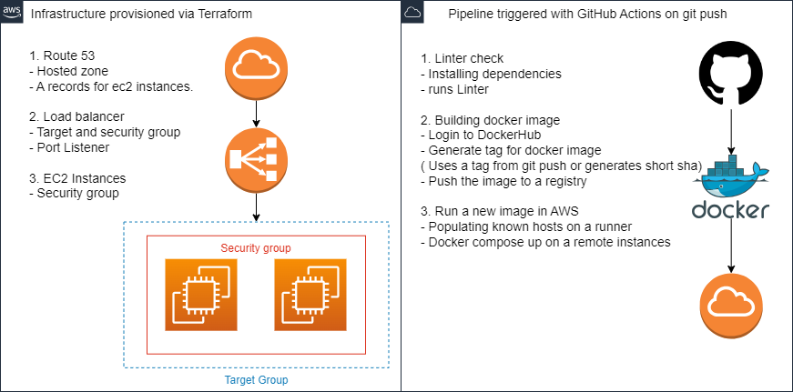

# Homework project
This project establishes a streamlined CI/CD pipeline using GitHub Actions, Packer, Docker Hub, and Terraform. The pipeline automates the building and deployment processes. AWS infrastructure is provisioned via Terraform, and Docker images are built and pushed to Docker Hub for deployment.
